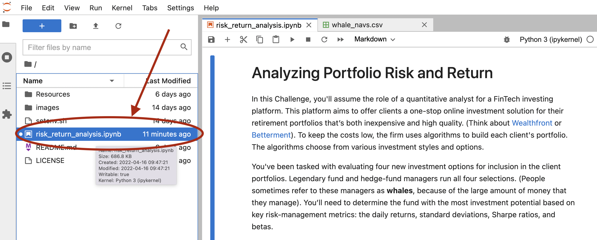

# PORTFOLIO-INSIGHT
**PORTFOLIO-INSIGHT** is a quantitative analytical tool used for evaluating new investment options for inclusion in client portfolios.
This analytical notebook will assess investment options on the following characteristics: 
* Performance
* Volatility
* Risk
* Risk-return profile
* Portfolio diversification

---

## Technologies

* **Pandas**  - A python library with advanced financial analysis tools.
* **Jupyter Lab** - An IDE used for visualization.
* **anaconda** - A python framework consisting of several tools used in financial analysis, such as Pandas and Jupyter Lab.

---

## Usage

### Prerequisites
The following are required to use this analytical notebook
* Python 3.7+
* Anaconda
* Jupyter Lab
* Pandas
For instructions on how to install these and how to run Jupyter Lab, please refer to *Installation Guide* found at [Cryptage](https://github.com/CAMPSMITH/cryptage.git)

### Running the Cryptage Notebook
Once Jupyter Lab has started in your browser, select the **crypto_arbitrage.ipynb** notebook from the **Left Sidebar**.

---

## Contributors

*  **Martin Smith** &nbsp;&nbsp; |
&nbsp;&nbsp; *email:* msmith92663@gmail.com &nbsp;&nbsp;|
&nbsp;&nbsp; 

---

## License

